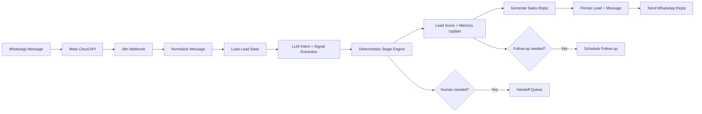

# WhatsApp AI Sales Agent

A **stateful WhatsApp sales automation** built with **n8n, Meta WhatsApp Cloud API, Supabase/PostgreSQL, and an LLM**.

This project goes beyond a simple chatbot. It keeps a persistent sales state for each prospect, extracts buying signals from conversation, applies deterministic stage-transition rules, tracks objections and qualification data, schedules follow-ups, supports booking intent, and hands the conversation to a human when appropriate.

> **Portfolio implementation:** this repository is a sanitized public implementation based on WhatsApp automation patterns I have built and worked with in private projects. It contains fictional business data and no production credentials, customer information, private prompts, internal endpoints, or proprietary project code.

## Core sales state machine

```text
NEW
 ↓
DISCOVERY
 ↓
QUALIFYING
 ↓
INTERESTED
 ↓
BOOKING
 ↓
HUMAN HANDOFF
 ↓
WON / LOST / NURTURE
```

The stages are **not chosen freely by the LLM**. The model extracts intent and structured sales signals; deterministic workflow logic decides whether a stage transition is allowed.

## What this project demonstrates

- Meta WhatsApp Cloud API webhook handling
- persistent prospect and conversation state
- structured LLM intent extraction
- deterministic sales-stage transitions
- qualification data collection
- objection detection and memory
- lead scoring
- contextual response generation
- meeting / booking intent
- human handoff
- scheduled follow-ups
- opt-out handling
- terminal outcomes: Won / Lost / Nurture
- conversation and stage-history logging
- separation of AI interpretation from business rules

## High-level architecture



## Why state matters

A stateless bot can easily repeat questions or ignore earlier context.

For example, if the lead is already in `INTERESTED` and says:

> Can we speak tomorrow afternoon?

the system should move toward `BOOKING`, not restart discovery.

If the prospect says:

> This sounds expensive.

the workflow records the objection, keeps the previous qualification data, and responds in the context of the current stage.

## Persistent lead memory

The public data model stores fields such as:

```text
lead_stage
product_interest
company
role
budget
timeline
pain_point
objection
last_intent
lead_score
meeting_status
preferred_meeting_time
human_handoff
opted_out
last_contact_at
next_followup_at
final_outcome
```

See [docs/data-model.md](docs/data-model.md).

## Stage transition philosophy

The LLM may return:

```json
{
  "intent": "booking_request",
  "pain_point": "Manual lead follow-up takes too much time",
  "budget": "",
  "timeline": "this month",
  "objection": "",
  "wants_booking": true,
  "wants_human": false,
  "purchase_signal": true,
  "opted_out": false
}
```

But it does **not** return:

```json
{
  "lead_stage": "BOOKING"
}
```

The workflow's deterministic state engine decides the next stage.

This prevents the model from skipping required business logic simply because it generated a confident answer.

## Allowed lifecycle

The portfolio workflow supports the primary path:

```text
NEW → DISCOVERY → QUALIFYING → INTERESTED → BOOKING → HUMAN_HANDOFF
```

and terminal outcomes:

```text
HUMAN_HANDOFF → WON
HUMAN_HANDOFF → LOST
HUMAN_HANDOFF → NURTURE
```

There are also controlled exceptions:

- explicit human request → `HUMAN_HANDOFF`
- opt-out / clear rejection → `LOST`
- booking request from a sufficiently engaged lead → `BOOKING`
- terminal stages cannot be silently reopened by the AI

See [docs/state-machine.md](docs/state-machine.md).

## Example conversation

### First message

**Prospect**

> Hi, we're losing a lot of time manually following up with website leads.

The workflow can extract:

```text
intent: discovery_answer
pain_point: manual lead follow-up
stage: NEW → DISCOVERY
```

### Qualification

**Agent**

> That sounds like a good automation use case. Roughly how many leads are you handling in a month?

The answer becomes part of the persistent lead state.

### Objection

**Prospect**

> I'm interested, but this sounds expensive.

The system stores:

```text
objection = price
```

without losing the earlier pain point, company, timeline, or product interest.

### Booking

**Prospect**

> Can we speak tomorrow afternoon?

The stage engine moves the conversation toward:

```text
INTERESTED → BOOKING
```

and stores the preferred meeting time.

## Repository structure

```text
.
├── workflow/
│   ├── whatsapp-sales-agent.json
│   ├── sales-followup-worker.json
│   └── sales-outcome-update.json
├── supabase/
│   └── schema.sql
├── docs/
│   ├── architecture.md
│   ├── data-model.md
│   ├── state-machine.md
│   └── whatsapp-integration.md
├── examples/
│   ├── inbound-message.json
│   ├── booking-message.json
│   └── outcome-update.json
├── .env.example
├── LICENSE
└── README.md
```

## Workflow 1 — WhatsApp Sales Agent

`workflow/whatsapp-sales-agent.json`

Handles inbound WhatsApp messages:

1. normalize Meta webhook payload
2. load lead state from Supabase
3. extract sales intent and structured signals
4. apply deterministic state transitions
5. calculate/update lead score
6. generate a contextual reply
7. persist lead state and message history
8. schedule a follow-up when appropriate
9. send the WhatsApp reply
10. create a human-handoff record when required

## Workflow 2 — Follow-up Worker

`workflow/sales-followup-worker.json`

Runs periodically and finds due follow-ups.

Before sending anything it rechecks:

- prospect has not opted out
- lead is not already Won/Lost
- human has not taken over
- the follow-up is still relevant
- correct WhatsApp delivery mode should be used

The public workflow keeps the outbound adapter explicit so it can be tested safely.

## Workflow 3 — Sales Outcome Update

`workflow/sales-outcome-update.json`

Provides a small human-controlled endpoint for marking a handed-off lead:

```text
WON
LOST
NURTURE
```

The AI cannot mark a deal Won.

## Supabase schema

The schema includes:

- `sales_leads`
- `sales_messages`
- `sales_stage_history`
- `sales_followups`
- `sales_handoffs`

Run:

```text
supabase/schema.sql
```

against a test Supabase/PostgreSQL project.

## Demo business

The workflow uses a fictional B2B automation company for portfolio testing.

No private brand, client, customer, or production data is included.

## Environment variables

See [.env.example](.env.example).

The key integrations are:

- Meta WhatsApp Cloud API
- Supabase REST API
- LLM provider

## WhatsApp policy boundary

A production implementation must respect Meta's current WhatsApp messaging and template policies.

The follow-up workflow distinguishes normal conversational replies from outbound follow-up delivery so a production deployment can enforce the correct messaging mechanism instead of blindly sending unrestricted messages.

## Human handoff

Human handoff can be triggered by:

- explicit request to speak with a person
- booking / commercial discussion that requires a sales rep
- unsupported request
- high-value lead requiring manual attention
- workflow uncertainty

Once `human_handoff = true`, the AI does not continue normal autonomous sales conversation until the handoff is cleared by a human-controlled process.

## Planned validation

This repository is **not yet marked as tested**.

The later validation pass will cover:

- new lead
- returning lead
- repeated message
- discovery progression
- qualification progression
- price objection
- booking request
- explicit human request
- opt-out
- due follow-up
- cancelled follow-up
- human handoff
- Won / Lost / Nurture update
- malformed webhook payload
- Meta API failure
- Supabase failure

Execution screenshots and test evidence will be added after live validation.

## License

MIT License. See [LICENSE](LICENSE).
